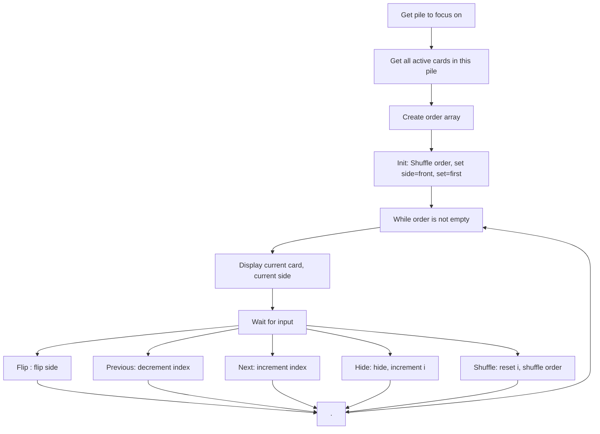

```mermaid
flowchart TD
    1[Get pile to focus on]
    2[Get all active cards in this pile]
    3[Create order array]
    4[Init: Shuffle order, set side=front, set=first]
    6[While order is not empty]
    7[Display current card, current side]
    8[Wait for input]
    9[Flip : flip side]
    10[Previous: decrement index]
    11[Next: increment index]
    12[Hide: hide, increment i]
    13[Shuffle: reset i, shuffle order]
    14[.]


    1-->2-->3-->4-->6-->7-->8
    8-->9
    8-->10
    8-->11
    8-->12
    8-->13
    9-->14
    10-->14
    11-->14
    12-->14
    13-->14
    14-->6
```